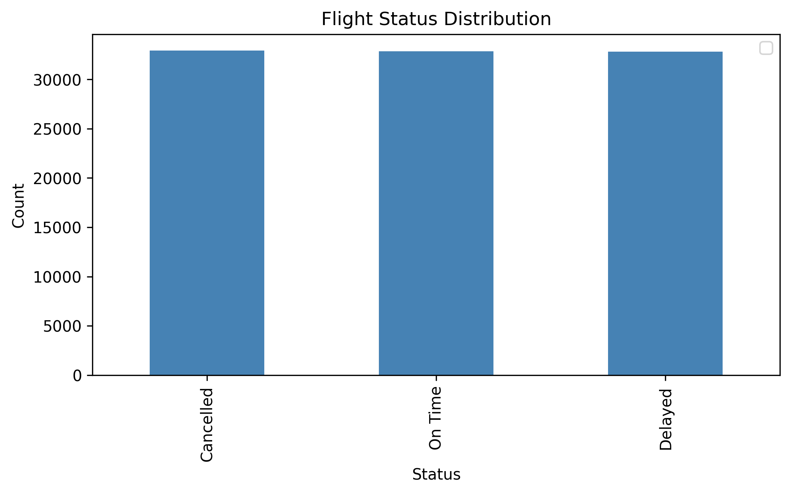
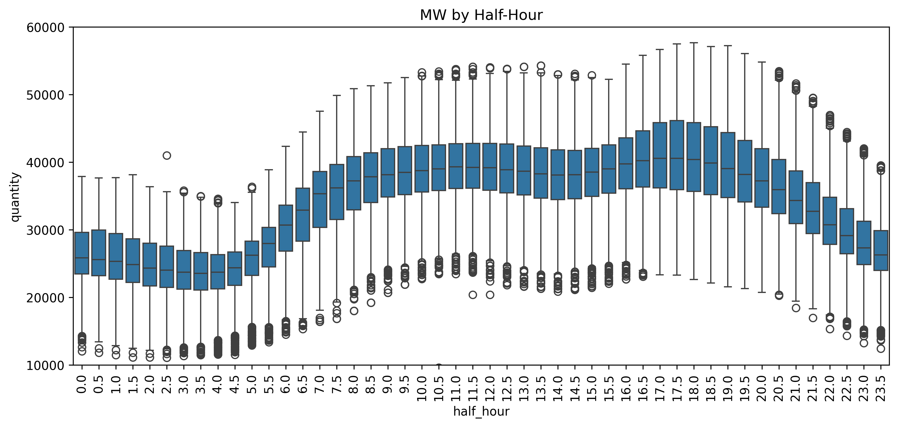
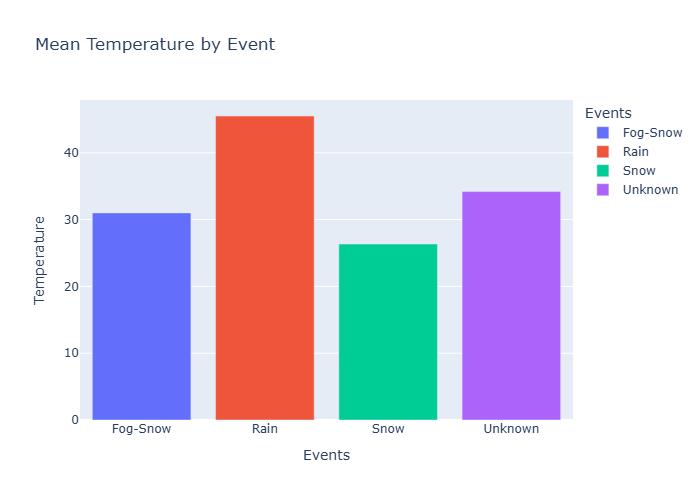
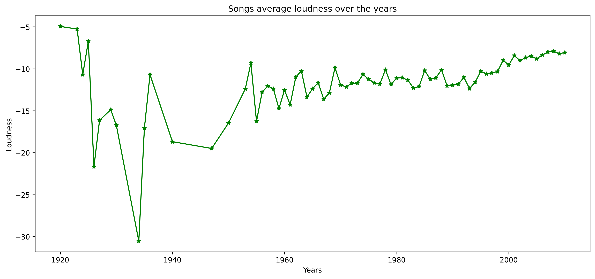

# Data Analysis Projects

This repository contains a collection of data analysis projects across different domains. Each project explores real-world datasets, applies exploratory data analysis (EDA), and uses visualizations to uncover insights.

---

## 📂 Projects Overview

### ✈️ Airline Data Analysis
- **Focus:** Flight delays, cancellations, and performance trends.
- **Highlights:**  
  - Identified common causes of delays.  
  - Analyzed time-of-day and seasonal flight patterns.  
  - Visualized delay distributions and airline comparisons.  
- [Explore Project](./airline)

📊 Example Visualization:  

---

### ⚡ Energy Consumption Analysis
- **Focus:** Electricity demand and usage patterns.  
- **Highlights:**  
  - Extracted hourly, daily, and monthly usage trends.  
  - Boxplot analysis of peak vs off-peak demand.  
  - Insights on minimum, median, and maximum consumption patterns.  
- [Explore Project](./energy)

📊 Example Visualization:  

---

### 🌦️ Weather Data Analysis
- **Focus:** Rainfall, temperature, and extreme weather trends.  
- **Highlights:**  
  - Handled missing values and trace precipitation.  
  - Compared seasonal weather patterns.  
  - Correlated weather factors with other environmental variables.  
- [Explore Project](./weather)

📊 Example Visualization:  

---

### 🎵 Songs Dataset Analysis
- **Focus:** Music trends over time.  
- **Highlights:**  
  - Songs becoming louder across decades.  
  - Most tracks cluster around 3–4 minutes despite extreme outliers.  
  - A few artists dominate the dataset.  
- [Explore Project](./songs)

📊 Example Visualization:  

---

### 🌍 Earthquake Data Analysis
- **Focus:** Global earthquake occurrences.  
- **Highlights:**  
  - Identified strongest and deepest earthquakes.  
  - Visualized magnitude and depth distributions.  
  - Mapped regional seismic activity.  
- [Explore Project](./earthquake)

📊 Example Visualization:  

---

## 🛠️ Tools & Libraries
- **Languages:** Python  
- **Libraries:** Pandas, NumPy, Matplotlib, Seaborn, Plotly  
- **Environment:** Jupyter Notebook  

---

## 📌 About
This repository serves as a portfolio of my data analysis projects. Each project folder contains:  
- The dataset (or link to source).  
- A Jupyter Notebook with analysis and visualizations.  
- A project-specific README (for details).  

---
